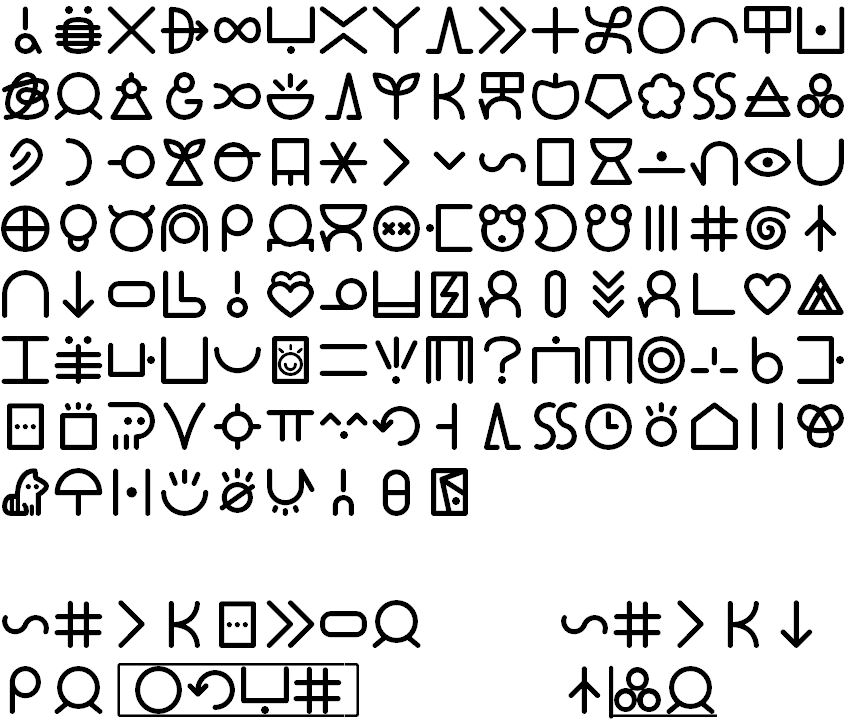

# sitelen pona UCSUR guide!!!
o sitelen e sitelen pona lon ilo mute a!

## Render sitelen pona on most desktop applications!
Due to the standardization of codepoints in the UCSUR, you can now render sitelen pona on many desktop applications (Firefox, Discord, etc). In many applications all you need to do is install a UCSUR compatible sitelen pona font, and you are good to go. However there are some quirks, and you need an input engine to be able to easily input these characters, which is the purpose of this guide.

# Fonts

The current recomended fonts for sitelen pona are:

  - [Fairfax HD](https://www.kreativekorp.com/software/fonts/fairfaxhd.shtml)
  
      
      
	This font supports the 2022-05-20 version of UCSUR. It looks a bit nasa, however it is mostly readable.
  - [nasin nanpa](https://github.com/ETBCOR/linja-nanpa)
  
      
      
      This is an alternative font, actively being developed by jan Itan (@etbcor#6146). It is monospace, and supports cartouches, combination glyphs, and long glyphs (pi, tawa & lon). This font supports the 
      2022-05-20 version of UCSUR.
  - [insa pi supa lape](http://devurandom.xyz/tokipona/supalape.html)
      
      
      
      This font by /dev/urandom/ supports an outdated version of UCSUR (2022-01-31).

If you are unsure of which font to pick, I would recomend linja nanpa.

Once you have installed any of these fonts you are done, in many applications sitelen pona should render correctly, with the exception of websites, as they do not fall back to sitelen pona. This is an issue, because some applications are actually websites, with a notable example being Discord. 

## Discord

Because internally the Discord application relies on electron, it does not fall back to the font you installed when sitelen pona glyphs are present, instead displaying these frustrating little squares. To fix this, sadly the only option is to modify your Discord. Currently, this modification is possible on all Desktop systems, and on Android.

### Desktop

To patch your Discord to correctly render sitelen pona on desktop, we will use the [Powercord client modification](https://powercord.dev/). Start by following the installation guide on their website to install it. After installing Powercord we need to add a CSS snippet, this is a small snippet of code that tells Powercord to use Fairfax HD or linja nanpa when sitelen pona is present.

First go to "User Settings" in Discord, then scroll down to "Themes" and click the "Quick CSS" tab.

Paste this snippet of code into the text box. (No need to worry about security! CSS can only change visual aspects of Discord, not steal your login token or act on your behalf)
```CSS
:root {
    --font-primary: 'gg sans', 'Noto Sans', 'Helvetica Neue', Helvetica, Arial, sans-serif, "linja-nanpa", "Fairfax HD", "insa pi supa lape";
    --font-display: 'gg sans', 'Noto Sans', 'Helvetica Neue', Helvetica, Arial, sans-serif, "linja-nanpa", "Fairfax HD", "insa pi supa lape";
    --font-code: Consolas, 'Andale Mono WT', 'Andale Mono', 'Lucida Console', 'Lucida Sans Typewriter', 'DejaVu Sans Mono', 'Bitstream Vera Sans Mono', 'Liberation Mono', 'Nimbus Mono L', Monaco, 'Courier New', Courier, monospace, "linja-nanpa", "Fairfax HD", "insa pi supa lape";
    --font-headline: 'ABC Ginto Nord', 'Noto Sans', 'Helvetica Neue', Helvetica, Arial, sans-serif, "linja-nanpa", "Fairfax HD", "insa pi supa lape";
}
```

Once you have pasted this code into the Quick CSS box, you can now exit settings, your Discord should be properly set up to render sitelen pona!

### Android

I do not own an Android phone, so I cannot give an accurate guide on this section (maybe somebody fill this in with a pull request), however kulupu Mimuki (rats#0976) has put together an [excellent video guide](https://cdn.discordapp.com/attachments/882652782509846548/943688987070062612/YouCut_20220217_121644150.mp4) for achieving this with [Aliucord](https://github.com/Aliucord/Aliucord).

### Browser

If you use a web browser, you can use the [stylus extension](https://github.com/openstyles/stylus#releases) to add the css code above. Simply click on the extension with a discord tab open, and use the "write a style for:" menu. Be sure to no accidentally write it for "this url", as that will make it not work outside of the channel you were looking at.

## Input

Now that sitelen pona is rendering properly, we need to be able to type it!

### Windows
If you use windows, there is an [Auto Hotkey Script](https://github.com/ETBCOR/nasin-nanpa/releases/download/n2.5.1/sitelen-pona-3.0.ahk) (download with ctrl+s) by jan Itan (@etbcor#6146) for input. Write the toki pona word and then a \` (the letter under escape) to convert it into sitelen pona. You can also write '\[\`' and '\]\`' for cartouches, as well as '\(\`' and '\)\`' for long glyphs. There is also a ["small" version of the script](https://github.com/ETBCOR/nasin-nanpa/releases/download/n2.5.1/stl-pon-3.0.ahk) that uses 3 letter codes for each word instead of typing the whole word. For any of this to work, you need to have [Auto Hotkey](https://www.autohotkey.com/) installed.
Other features of the script are explained near the bottom of [nasin-nanpa's releases page](https://github.com/ETBCOR/nasin-nanpa/releases/tag/n2.5.1).

### macOS

jan Tepo (tbodt#7244) has made an [input plugin for macOS](https://raw.githubusercontent.com/Id405/sitelen-pona-ucsur-guide/main/sitelen-pona.inputplugin) with modifications by jan Semu (rhythm heaven monkey#9052) to support the 2022-05-20 version of UCSUR (download with ctrl+s). Install it by double clicking. Then enable it in System Preferences > Keyboard > Input Sources. You'll find it listed under "Chinese, Simplified" for some reason.

### Linux

The only current supported input engine for Linux is ibus, for this to work, you need both ibus, and ibus-tables installed.

jan Komi (cominixo#5443) has created an [ibus input table](https://raw.githubusercontent.com/Id405/sitelen-pona-ucsur-guide/main/tokipona.txt) (download with ctrl+s). Copy it to a directory of your choice, and then open a command line in the same directory. Run these commands to install it.


```bash
sudo ibus-table-createdb -n /usr/share/ibus-table/tables/tokipona.db -s tokipona.txt
ibus-daemon -drxR
```

Once you have done this, open the ibus preferences, go to Input Method, click ADD and then select sitelen pona (the last option under the English category). Cartouches are typed with '\[', '\_', and '\]'. Long pi is started with 'pi_' and extended with '.

### Android

Two input engines for android exist:
  - [jan Komi's (cominixo#5443)](https://github.com/cominixo/tokiponakeyboard/releases/tag/v0.1-sp)
  - and [kulupu Mimuki's (rats#0976)](./android_keyboard.zip) which can be used with [this app](https://play.google.com/store/apps/details?id=de.humbergsoftware.keyboarddesigner), but it requires a paid addon to import the file.

### Web

If you are on a device which cannot use these input methods for any reason, [jan Tala (@at#0754)](https://github.com/DataKinds) has created a [web based converter](https://ilo-pi-sitelen-pona.glitch.me/) from sitelen Lasina to sitelen pona.

# End

This is a really huge step for toki pona, and I am extremely happy to see this happen. If you have created a font, input method, or any other resource that you want added, please create a pull request, issue, or just ping me on discord @8o7wer#4073 (jan Lili lon ma pona pi toki pona) and we can talk!
